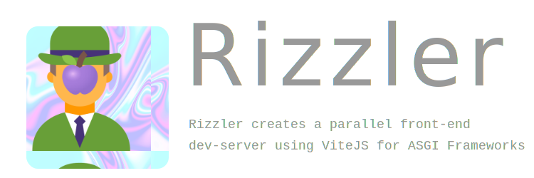

# Rizzler

[](https://pypi.org/project/rizzler)
[](https://pypi.org/project/rizzler)
[](https://pypi.org/project/rizzler)
[](https://pypi.org/project/rizzler)
[](.)
[](.)
[](.)
[](.)
[](.)
[](https://github.com/aekasitt/rizzler/blob/master/static/rizzler-banner.svg)

## Installation

Install using pip

```sh
$ pip install rizzler
> ...
```

## Usage

Integrate with `lifespan` protocol.

```python
from contextlib import asynccontextmanager
from fastapi import FastAPI
from fastapi.requests impor Request
from fastapi.responses import HTMLResponse
from rizzler import RizzleTemplates, Rizzler
from typing import AsyncIterator, List, Tuple

@Rizzler.load_config
def rizzler_settings() -> List[Tuple[str, str]]:
  return [
    ("command", "pnpm"),
    ("framework", "vue")
  ]

@asynccontextmanager
async def lifespan(_: FastAPI) -> AsyncIterator[None, None]:
  await Rizzler.serve()
  yield
  Rizzler.shutdown()

app: FastAPI = FastAPI(lifespan=lifespan)
templates: RizzleTemplates = RizzleTemplates(directory="templates")

@app.get("/", response_class=HTMLResponse)
async def index(request: Request) -> HTMLResponse:
  return templates.TemplateResponse("index.html", {"request": request})
```

### Templating

`RizzleTemplates` is an extension on top of `Jinja2Templates` class found under [starlette](starlette.io)
However, has two overriding methods that must be placed inside the template HTML-file as such:

```html
<!DOCTYPE html>
<html>
  <head><!-- ... --></head>
  <body>
    {{ vite_hmr_client() }}
    {{ vite_asset('pages/main.js') }}
  </body>
</html>
```

## Build

This section talks about how to use `Jinja2Templates` in place of `RizzleTemplates` for built assets
from the `vite build` command inside `package.json`.

To be determined.

## Contributions

To be determined.

## Acknowledgements

* [fastapi-vite](https://github.com/cofin/fastapi-vite)
* [django-vite](https://github.com/MrBin99/django-vite)

## License

This project is licensed under the terms of the MIT license.
