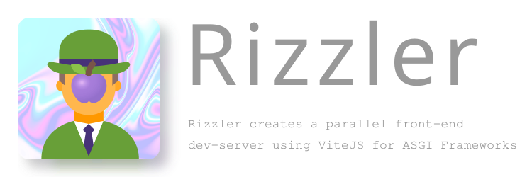

# Rizzler

[](https://pypi.org/project/rizzler)
[](https://pypi.org/project/rizzler)
[](https://pypi.org/project/rizzler)
[](https://pypi.org/project/rizzler)
[](.)
[](.)
[](.)
[](.)
[](.)
[](https://github.com/aekasitt/rizzler/blob/master/static/rizzler-banner.svg)

## Installation

Install with the recommended [Jinja2](https://jinja.palletsprojects.com/en/stable/) engine:

```sh
pip install "rizzler[jinja2]"
```

Or use [MiniJinja](https://github.com/mitsuhiko/minijinja) engine
powered by [Rust](https://rust-lang.com) 🦀:

```sh
pip install "rizzler[minijinja]"
```

## Usage

Integrate with `lifespan` protocol.

```python
from collections.abc import AsyncIterator
from contextlib import asynccontextmanager
from fastapi import FastAPI
from fastapi.requests import Request
from fastapi.responses import HTMLResponse
from rizzler import RizzleTemplates, Rizzler

@Rizzler.load_config
def rizzler_settings() -> list[tuple[str, str]]:
    return [
        ("command", "pnpm"),
        ("framework", "vue")
    ]

@asynccontextmanager
async def lifespan(_: FastAPI) -> AsyncIterator[None, None]:
    await Rizzler.serve()
    yield
    Rizzler.shutdown()

app: FastAPI = FastAPI(lifespan=lifespan)
templates: RizzleTemplates = RizzleTemplates(directory="templates")

@app.get("/", response_class=HTMLResponse)
async def index(request: Request) -> HTMLResponse:
    return templates.TemplateResponse(request, "index.html")
```

### Templating

`RizzleTemplates` supports Jinja2 and MiniJinja. MiniJinja is selected when it is
installed; otherwise, the Jinja2 backend is used. Both backends expose two Vite
helpers that can be placed in an HTML template as follows:

```html
<!DOCTYPE html>
<html>
    <head><!-- ... --></head>
    <body>
        {{ vite_hmr_client() }}
        {{ vite_asset('pages/main.js') }}
    </body>
</html>
```

## Build

You can run the following command once you are done customizing the front-end code under `pages/` directory
to your liking.

```sh
rzl build
```

<details>
  <summary>Example outputs for `rzl build`</summary>

  ```sh
  $ rzl build
  > INFO     ⚡Building Rizzler front-end…
  > INFO
  > INFO     > rzl-tmp@0.0.0 build /Users/user/workspaces/rzl-react
  > INFO     > vite build                                       
  > INFO                                                       
  > INFO     vite v5.3.3 building for production...           
  > INFO     transforming...                                 
  > INFO     ✓ 32 modules transformed.                      
  > INFO     rendering chunks...                           
  > INFO     computing gzip size...                       
  > INFO     dist/rizz.svg    4.13 kB │ gzip:  2.14 kB   
  > INFO     dist/rizz.css    1.39 kB │ gzip:  0.72 kB  
  > INFO     dist/rizz.js   142.63 kB │ gzip: 45.74 kB 
  > INFO     ✓ built in 390ms
  ```
</details>

Now you can stop using `RizzleTemplates` and revert back to serving front-end with `Jinja2Templates`
as such

```python
#!/usr/bin/env python3
from fastapi import FastAPI
from fastapi.requests import Request
from fastapi.responses import HTMLResponse
from fastapi.staticfiles import StaticFiles
from fastapi.templating import Jinja2Templates

app = FastAPI()
templates = Jinja2Templates(directory="dist")

@app.get("/", response_class=HTMLResponse)
def index(request: Request) -> HTMLResponse:
    return templates.TemplateResponse("index.html", {"request": request})

app.mount("/", StaticFiles(directory="dist"), name="dist")
```

Now you have a production front-end to go with your `FastAPI` application when you need.
There will probably be bugs when it comes to relative versus absolute paths in the future.
But this is good enough for many prototyping use-case and with a bit of tinkering, can replace 

## Change-logs

* **0.1.9** Drop Python 3.9 support; Modernize syntax removing `typing.List`, `typing.Optional`
  and `typing.Tuple`
* **0.2.0** Add `granian` as `logger_name` option
* **0.2.1** Allow swappable templating engine via extras; `rizzler[jinja2]` | `rizzler[minijinja]`

  :construction: **BREAKING CHANGE**
  0.2.0 -> 0.2.1: Templating engine is not available by default, pending [PEP-771](https://peps.python.org/pep-0771/)

## Dependencies and Disclosures

This library relies on the following Python dependencies.

- **click** - Python composable command line interface toolkit 
  [](https://github.com/pallets/click)
  [](https://pypi.org/project/click)
  [](https://click.palletsprojects.com/en/8.1.x)
- **jinja2** - A very fast and expressive template engine
  [](https://github.com/pallets/jinja)
  [](https://pypi.org/project/jinja2)
  [](https://jinja.palletsprojects.com/en/3.1.x)
- **minijinja** - A Jinja-compatible template engine implemented in Rust
  [](https://github.com/mitsuhiko/minijinja)
  [](https://pypi.org/project/minijinja)
- **markupsafe** - Safely add untrusted strings to HTML/XML markup
  [](https://github.com/pallets/markupsafe)
  [](https://pypi.org/project/markupsafe)
  [](https://markupsafe.palletsprojects.com/en/2.1.x)
- **pydantic** - Data validation using Python type hints
  [](https://github.com/pydantic/pydantic)
  [](https://pypi.org/project/pydantic)
  [](https://docs.pydantic.dev)
- **PyYAML** - Full-featured YAML framework for the Python
  [](https://github.com/yaml/pyyaml)
  [](https://pypi.org/project/pyyaml)
  [](https://pyyaml.org)
- **rich** - Rich text and beautiful formatting in the terminal
  [](https://github.com/Textualize/rich)
  [](https://pypi.org/project/rich)
  [](https://rich.readthedocs.io/en/latest)
- **starlette** - Lightweight ASGI framework / toolkit
  [](https://github.com/encode/starlette)
  [](https://pypi.org/project/starlette)
  [](https://www.starlette.io)
- **tree-sitter** - An incremental parsing system for programming tools 
  [](https://github.com/tree-sitter/tree-sitter)
  [](https://pypi.org/project/tree-sitter)
  [](https://tree-sitter.github.io/tree-sitter)
  - **tree-sitter-html**
    [](https://github.com/tree-sitter/tree-sitter-html)
    [](https://pypi.org/project/tree-sitter-html)
  - **tree-sitter-javascript**
    [](https://github.com/tree-sitter/tree-sitter-javascript)
    [](https://pypi.org/project/tree-sitter-javascript)

## Contributions

### Prerequisites

I recommend using `uv` as the preferred tool to managing dependencies and virtual environment
in your development workflow.

- **uv** - An extremely fast Python package and project manager, written in Rust.
  [](https://github.com/astral-sh/uv)
  [](https://pypi.org/project/uv)
  [](https://docs.astral.sh/uv)

### Setup development environment

To contribute to the project, fork the repository and clone to your local device and development
dependencies including four extra libraries not included in final builds as such:
Alternatively, run the following command on your terminal to do so:

```bash
uv sync --dev
```

- **ruff** An extremely fast Python linter and code formatter, written in Rust.
  [](https://github.com/astral-sh/ruff)
  [](https://pypi.org/project/ruff)
  [](https://docs.astral.sh/ruff) 

## Acknowledgements

* [fastapi-vite](https://github.com/cofin/fastapi-vite)
* [django-vite](https://github.com/MrBin99/django-vite)
* [MiniJinja: Learnings from Building a Template Engine in Rust](https://lucumr.pocoo.org/2024/8/27/minijinja/)
  by [Armin Ronacher](https://lucumr.pocoo.org) [🐱🐙: @mitsuhiko](https://github.com/mitsuhiko)

## License

This project is licensed under the terms of the MIT license.
